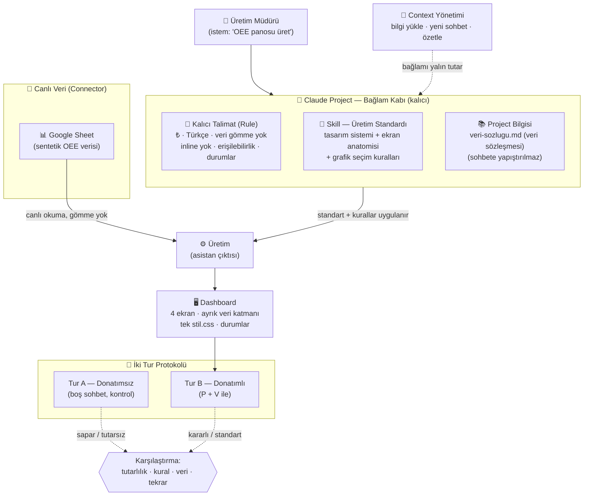

# Yönetişim Mimarisi Diyagramı (ZORUNLU)

Bağlam / Kalıcı Talimat / Skill-Gem / Canlı Veri'nin nasıl birlikte çalıştığını gösterir.
(GitHub'da ve çoğu Markdown→PDF aracında otomatik render olur.)

## Akışın Özeti
1. **Bağlam (Project)** kalıcı kabı taşır; içine **Kalıcı Talimat (Rule)**, **Skill (standart)** ve **veri sözleşmesi** yerleşir.
2. **Canlı Veri (Connector)** bağlı Google Sheet'ten **gömmeden** okunur.
3. Asistan, kurallar + standart altında **dashboard'u üretir** (ayrık veri katmanı, tek stil, durumlar).
4. **Context yönetimi** bağlamı yalın tutar (bilgi yükleme, yeni sohbet, özet).
5. **İki tur** (A donatımsız / B donatımlı) karşılaştırılır → kurumsallaşmanın değeri ölçülür.
