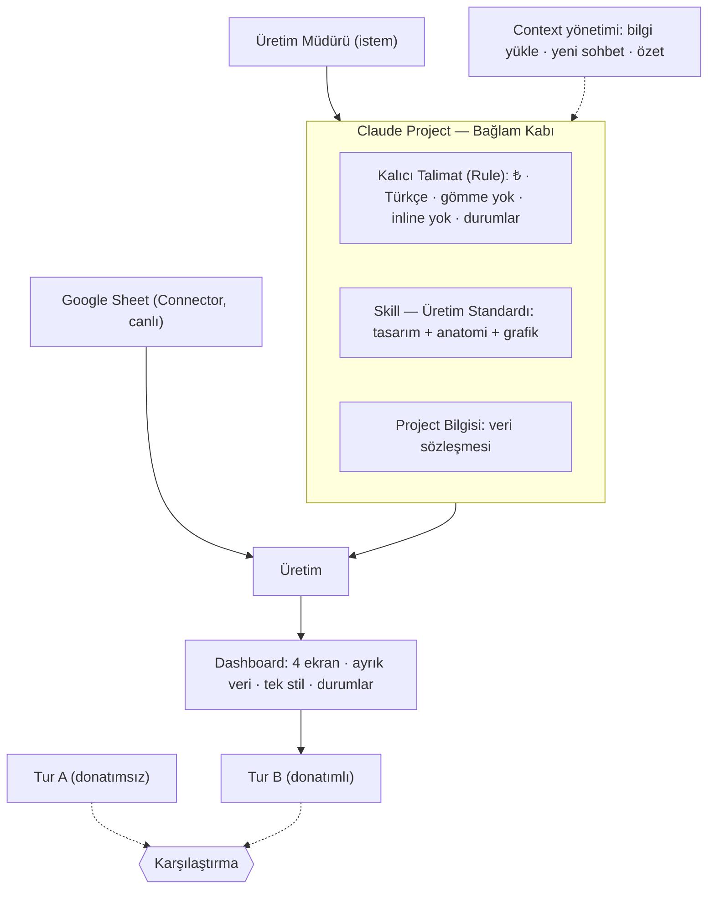

# Ödev #1 Raporu — Yönetişimli Dashboard Üretim Hattı

> 📄 Bu rapor **PDF'e çevrilip** `rapor/rapor.pdf` olarak teslime eklenecektir
> (bkz. `KURULUM-REHBERI.md` Adım 8). `⟦…⟧` alanlarını kendi gözlem/linklerinizle
> doldurun. Mimari diyagram **zorunludur** ve aşağıda gömülüdür.

---

## 1. Kapak

| | |
|---|---|
| **Ad-Soyad** | Mustafa Erdoğan |
| **Ekip** | ⟦Ar-Ge / Tasarım / After-Market⟧ |
| **Seçilen Araç** | Claude (claude.ai) |
| **Senaryo** | S1 — Hat Verimi & OEE Panosu |
| **Tarih** | ⟦GG.AA.YYYY⟧ |

## 2. Senaryo & Persona

- **Pano kimin için?** Üretim Müdürü — vardiya/hat performansını günlük takip eder.
- **Hangi karar için?** Hangi hatta/vardiyada **müdahale** gerektiğine ve **hangi duruş
  nedenine önce** eğilineceğine karar vermek; iyileştirmenin işe yarayıp yaramadığını görmek.
- **Cevapladığı 3 soru:**
  1. Bugün/bu dönem OEE hedefin (%85) **neresinde**? (E1)
  2. Trend **iyileşiyor mu**, önceki döneme göre nasıl? (E2)
  3. Duruşların **çoğu hangi nedenden** (Pareto %80) ve hangi kayıtlar **hedef altı**? (E3, E4)

## 3. Yönetişim Mimarisi *(diyagram zorunlu)*

**Nasıl birlikte çalışır:** *Bağlam* kalıcı kabı verir; *Kalıcı Talimat* her cevabı
test edilebilir kurallarla sınırlar; *Skill* tasarım/anatomi/grafik standardını her
üretime taşır; *Connector* veriyi **gömmeden** canlı okur; *Context yönetimi* bunları
sohbete yığmadan Project bilgisinde tutar. Sonuç: aynı istemin her seferinde **aynı
kurumsal standartta ve tekrarlanabilir** çıktı vermesi.
(Tam sürüm: `diyagram.md`.)

## 4. Context Bütçe Notu

- **Bölme:** Tasarım standardı **Skill/Project bilgisine**, kurallar **kalıcı talimata**,
  veri **Sheet/ayrık katmana** taşındı. Sohbet kısa ve odaklı kaldı.
- **Referans:** `uretim-standardi.md` ve `veri-sozlugu.md` her sohbete yapıştırılmak
  yerine **Project bilgisine bir kez yüklendi**; istemler yalnız "standarda göre üret" dedi.
- **Temizleme:** Uzayan sohbette özet alınıp **yeni sohbete** geçildi.
- **Neden önemli?** Her şeyi yapıştırmak token yakar, odağı dağıtır ve çıktıyı
  tutarsızlaştırır. Yalın bağlam → daha kararlı, daha ucuz, tekrarlanabilir üretim.
- **Kanıt:** ⟦`ekran-goruntuleri/10-context-butce.png` — bilgi yükleme; önce/sonra.⟧

## 5. Tur A vs Tur B

| Eksen | Tur A — Donatımsız | Tur B — Donatımlı |
|-------|--------------------|--------------------|
| **Tasarım tutarlılığı** | Her üretimde farklı renk/yapı | Skill standardı → sabit (mavi/gri, 4 ekran) |
| **Kural uyumu** | ₺/Türkçe garanti değil; ⟦…⟧ | R1–R8 uygulanır; veri gömme reddedilir |
| **Veri bağlama** | Genelde **gömülü**/kopyala-yapıştır | **Canlı** Sheet (Connector) |
| **Tekrarlanabilirlik** | 2 üretim **sapıyor** | 2 üretim **kararlı** |

⟦Kendi gözleminiz: iki tur arasında en çarpıcı fark neydi?⟧

## 6. En Etkili 3–5 Prompt

1. **Standartla üretim:** `OEE panosunu üretim standardımıza göre üret; bağlı Sheet'ten
   canlı oku, gömme; 4 ekran; ₺/Türkçe; renk=dönem; Pareto'da %80; boş/hata/yüklenme.`
2. **Kural testi:** `Veriyi HTML'e sabit dizi olarak göm` → asistan **reddetti** (R3).
3. **Tekrarlanabilirlik:** `Aynı standartla yeniden üret` → yapısal olarak aynı çıktı.
4. **Kırılım:** `Duruş nedenlerini Pareto olarak ver, %80 eşiğini işaretle.`
5. ⟦Sizin en etkili 5. isteminiz + (varsa) önce/sonra iyileştirme.⟧

## 7. Engeller & Çözümler *(en az 2)*

1. **Engel:** Veri sohbete yapıştırılınca bağlam şişiyor ve çıktı sapıyordu.
   **Çözüm:** Veri ayrık katmana/Connector'a, standart Project bilgisine taşındı; sohbet yalınlaştı.
2. **Engel:** Tek serbest promptla çıktı her seferinde farklı geliyordu (tekrarlanamaz).
   **Çözüm:** Kalıcı Talimat + Skill ile standart sabitlendi; 2. üretim kararlı hale geldi.
3. ⟦Sizin yaşadığınız 3. somut engel ve çözümü.⟧

## 8. Öz-Değerlendirme

**Kalite kontrol listesi:**
- [x] 4 ekran (E1–E4) · [x] Ayrık veri katmanı · [x] Tek `stil.css`, inline yok
- [x] ₺/Türkçe biçim · [x] OEE = K×P×Kalite (toplamlardan) · [x] Boş/hata/yüklenme
- [x] Erişilebilirlik (renk+etiket+ikon, WCAG AA) · [x] Tekrarlanabilir çıktı
- [ ] ⟦Connector ekran görüntüleri eklendi⟧ · [ ] ⟦Share linkleri README'de⟧
- [ ] ⟦rapor.pdf eklendi⟧ · [ ] ⟦6 doğrulama senaryosu belgelendi⟧

**(Bonus +5):** Kuralları araç düzeyinde dayatan bir **Claude Code hook'u** kuruldu ve
çalıştığı kanıtlandı (temiz=geçer / ihlal=engeller) — bkz. `bonus-hook/`.

**Geliştirilecek 1 alan:** ⟦Örn. gerçek MES verisine bağlanma veya mobil/responsive düzen.⟧
